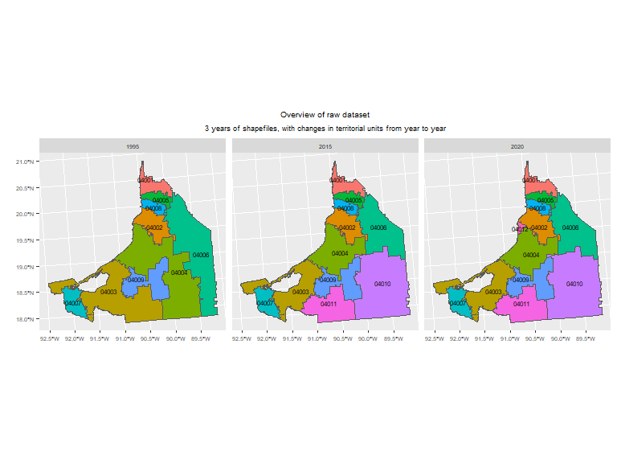
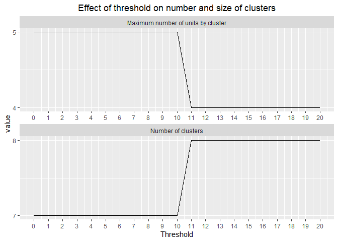

#

`amc.analysis` is an R package for standardizing territorial units over time by accounting for administrative boundary changes. It automatically detects and groups boundary modifications, such as mergers and splits, using an overlap-based network analysis.

The method conceptualizes overlapping polygons as a clustering problem, similar to the “friends-of-friends” approach in social network analysis. The resulting aggregated mapping units (AMCs) and corresponding crosswalk tables provide a consistent spatial framework for longitudinal or time-series analyses across changing territorial boundaries.

## Installation

To install this package, use:


``` r
remotes::install_github("NataliGomezL/amc.analysis")
```


## Usage

The example is based on the original data from the Mexican state of Campeche, where several municipalities experienced territorial changes between 1995 and 2020


``` r
library(amc.analysis)
library(ggplot2)
data(mexico_shps)
plot <- plot_territorial_units(shps =  mexico_shps,
                               id_unit_var = "cvegeo",
                               period_var = "year",
                               show_legend = FALSE,
                               show_label = TRUE,
                               label_size = 2)

plot + 
  ggplot2::theme(text = element_text(size=6.5)) +
  ggtitle("Overview of raw dataset")+
  labs(subtitle = "3 years of shapefiles, with changes in territorial units from year to year")
```




## Step 1: apply function `amc_overlap_analysis()`:


``` r
raw_overlap <- amc_overlap_analysis(shps =  mexico_shps,
                                    id_unit_var = "cvegeo",
                                    period_var = "year")
```

```
## Done for 1995 - 2015
```

```
## Done for 2015 - 2020
```

The resulting tibble summarizes pairs of overlapping territorial units, including their identifiers (dyad, row_a, row_b), the intersection and relative area measures (area_inter, area_a, area_b, area_a_overlapped, area_b_overlapped), and the corresponding time periods (year_A, year_B) in which the overlaps occur.


``` r
raw_overlap
```

```
## # A tibble: 26 × 10
##    dyad                 row_a row_b area_inter  area_a  area_b area_a_overlapped
##    <chr>                <chr> <chr>      [m^2]   [m^2]   [m^2]             <dbl>
##  1 1995_04001 2015_040… 1995… 2015…     2.08e9 2.08e 9 2.08e 9             100.0
##  2 1995_04005 2015_040… 1995… 2015…     1.27e9 1.27e 9 1.27e 9             100.0
##  3 1995_04006 2015_040… 1995… 2015…     7.73e9 1.31e10 7.73e 9              59.1
##  4 1995_04002 2015_040… 1995… 2015…     3.25e9 3.25e 9 3.25e 9             100. 
##  5 1995_04004 2015_040… 1995… 2015…     6.83e9 1.55e10 6.83e 9              44.2
##  6 1995_04008 2015_040… 1995… 2015…     1.07e9 1.07e 9 1.07e 9             100.0
##  7 1995_04003 2015_040… 1995… 2015…     7.11e9 1.28e10 7.11e 9              55.7
##  8 1995_04007 2015_040… 1995… 2015…     2.16e9 2.16e 9 2.16e 9             100.0
##  9 1995_04009 2015_040… 1995… 2015…     4.77e9 4.77e 9 4.77e 9             100.0
## 10 1995_04004 2015_040… 1995… 2015…     8.62e9 1.55e10 1.40e10              55.8
## # ℹ 16 more rows
## # ℹ 3 more variables: area_b_overlapped <dbl>, year_A <dbl>, year_B <dbl>
```


## Step 2: determine the threshold `amc_compare_threshold()`

Cartographic data often vary in quality, and territorial boundaries, especially those following natural features such as rivers or lakes, may shift slightly over time without representing an actual administrative change. As a result,`amc_overlap_analysis()` may detect numerous spurious overlaps caused by these minor boundary fluctuations.

The function `amc_compare_threshold()` enables users to set a minimum overlap threshold, specifying the percentage of area overlap required to be considered a true territorial change. This helps filter out noise and ensures that only meaningful boundary modifications are retained for further analysis. The function produces a graph and a tibble that allow users to easily identify the number of clusters (AMCs) and the maximum number of units per cluster generated as a function of the selected threshold. 


``` r
threshold_table <- amc_compare_threshold(df_overlap = raw_overlap)
```

<!-- -->

``` r
print(threshold_table, n = 14)
```

```
## # A tibble: 21 × 3
##    thresh n_clusters max_n_units_by_cluster
##     <dbl>      <int>                  <int>
##  1      0          7                      5
##  2      1          7                      5
##  3      2          7                      5
##  4      3          7                      5
##  5      4          7                      5
##  6      5          7                      5
##  7      6          7                      5
##  8      7          7                      5
##  9      8          7                      5
## 10      9          7                      5
## 11     10          7                      5
## 12     11          8                      4
## 13     12          8                      4
## 14     13          8                      4
## # ℹ 7 more rows
```

## Step 3: Create AMCs `amc_create_amc()`

Once the threshold is defined, use `amc_create_amc()` to aggregate overlapping units and assign an AMC ID to each cluster.

The selected threshold directly influences the final AMC configuration, so it is important to carefully determine an appropriate value. For illustration, the results below compare outcomes for thresholds of 10 and 11:


``` r
# Create AMC (threshold 10%)
amc_10 <- amc_create_amc(df_overlap = raw_overlap,
                         shps =  mexico_shps,
                         threshold = 10,
                         id_unit_var = "cvegeo",
                         period_var = "year",
                         ref_period = 2015)

# Create AMC (threshold 11%)
amc_11 <- amc_create_amc(df_overlap = raw_overlap,
                         shps =  mexico_shps,
                         threshold = 11,
                         id_unit_var = "cvegeo",
                         period_var = "year",
                         ref_period = 2015)


# Plot AMC (threshold 10%)
amc_plot_10 <- plot_AMC_byP(shps=  mexico_shps,
                            id_unit_var = "cvegeo",
                            period_var= "year",
                            amc_df = amc_10,
                            show_legend = TRUE,
                            show_label = FALSE,
                            label_size = 2)

amc_plot_10 + 
  ggplot2::theme(text = element_text(size=6.5)) +
  ggtitle("AMC with threshold 10")+
  labs(subtitle = "Produces only 7 AMC's")
```


``` r
# Plot AMC (threshold 11%)
amc_plot_11 <- plot_AMC_byP(shps=  mexico_shps,
                            id_unit_var = "cvegeo",
                            period_var = "year",
                            amc_df = amc_11,
                            show_legend = TRUE,
                            show_label = FALSE,
                            label_size = 2)
amc_plot_11 + 
  ggplot2::theme(text = element_text(size=6.5)) +
  ggtitle("AMC with threshold 11")+
  labs(subtitle = "Produces 8 AMC's")
```


## Step 4: Create a crosswalk table `amc_create_crosswalk()`

Use `amc_create_crosswalk()` to generate a tibble that identifies how each AMC is composed over time in terms of its constituent territorial units, as well as the relative weight that each unit contributes to the AMC.


``` r
crosswalk <- amc_create_crosswalk(shps = mexico_shps,
                                  amc_shp = amc_11,
                                  id_unit_var ="cvegeo",
                                  period_var = "year",
                                  threshold = 11)
print(crosswalk, n=20)
```

```
## # A tibble: 32 × 6
##    amc_id  id    period period_id  weight n_units
##    <chr>   <chr> <chr>  <chr>       <dbl>   <int>
##  1 AMC0001 04001 1995   1995_04001  100         1
##  2 AMC0001 04001 2015   2015_04001  100         1
##  3 AMC0001 04001 2020   2020_04001  100         1
##  4 AMC0002 04002 1995   1995_04002  100         1
##  5 AMC0002 04002 2015   2015_04002  100         1
##  6 AMC0002 04002 2020   2020_04002  100         1
##  7 AMC0003 04003 1995   1995_04003  100         1
##  8 AMC0003 04003 2015   2015_04003   55.7       2
##  9 AMC0003 04011 2015   2015_04011   44.3       2
## 10 AMC0003 04003 2020   2020_04003   55.7       2
## 11 AMC0003 04011 2020   2020_04011   44.3       2
## 12 AMC0004 04005 1995   1995_04005  100         1
## 13 AMC0004 04005 2015   2015_04005  100         1
## 14 AMC0004 04005 2020   2020_04005  100         1
## 15 AMC0005 04004 1995   1995_04004   54.2       2
## 16 AMC0005 04006 1995   1995_04006   45.8       2
## 17 AMC0005 04004 2015   2015_04004   24.0       3
## 18 AMC0005 04006 2015   2015_04006   27.1       3
## 19 AMC0005 04010 2015   2015_04010   48.9       3
## 20 AMC0005 04004 2020   2020_04004   23.1       4
## # ℹ 12 more rows
```

